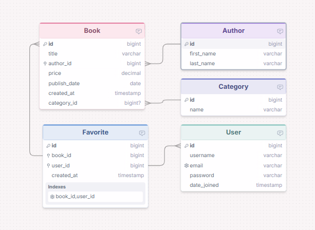
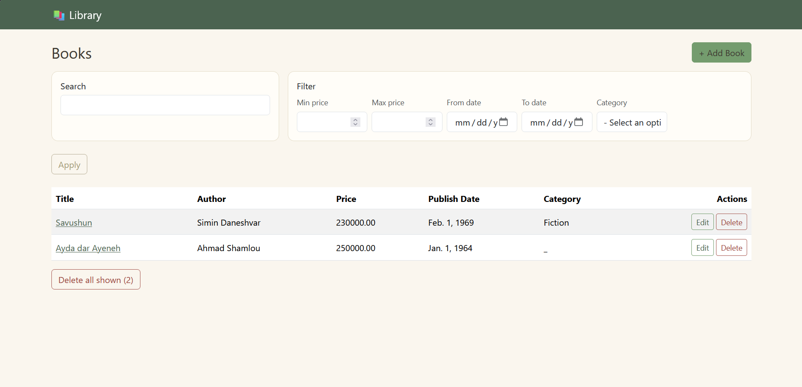

# Library Management System

A simple Django web app for managing a library's book catalog — built as a learning project to practice Django models, views, forms, and templates.

## Features

### Core
- Add, view, edit, and delete books
- Search books by title or author name
- Filter books by price range and publish date range
- Bulk delete all books matching the current filter

### Bonus
- Category management (filter/search books by category)
<!-- - User authentication (signup, login, logout) -->
<!-- - Favorites: users can mark books and view their personal list -->

## Tech Stack

- **Backend:** Python, Django
- **Database:** SQLite (development)
- **Package management:** [uv](https://docs.astral.sh/uv/)
- **Frontend:** Django Templates, Bootstrap 5
- **Linting:** Ruff

## ER Diagram



Core tables: `Author`, `Book`
Bonus tables: `Category`<!-- , `User`, `Favorite` -->

## Project Structure

```
library-management/
├── config/              # Django project settings
├── books/               # Main app: models, views, forms, templates
│   ├── models.py        # Author, Book, Category
│   ├── views.py
│   ├── forms.py
│   └── templates/
├── docs/
│   └── er-diagram.png
├── manage.py
├── pyproject.toml
└── uv.lock
```

## Setup & Run Locally

```bash
# 1. Clone the repository
git clone <this-repo-url>
cd library-management

# 2. Install dependencies (uv creates the virtual environment automatically)
uv sync

# 3. Apply database migrations
uv run manage.py migrate

# 4. (Optional) Create an admin account
uv run manage.py createsuperuser

# 5. Run the development server
uv run manage.py runserver
```

Then open `http://127.0.0.1:8000/books/` in your browser.

## Screenshots

<!-- Add screenshots here, e.g.: -->

